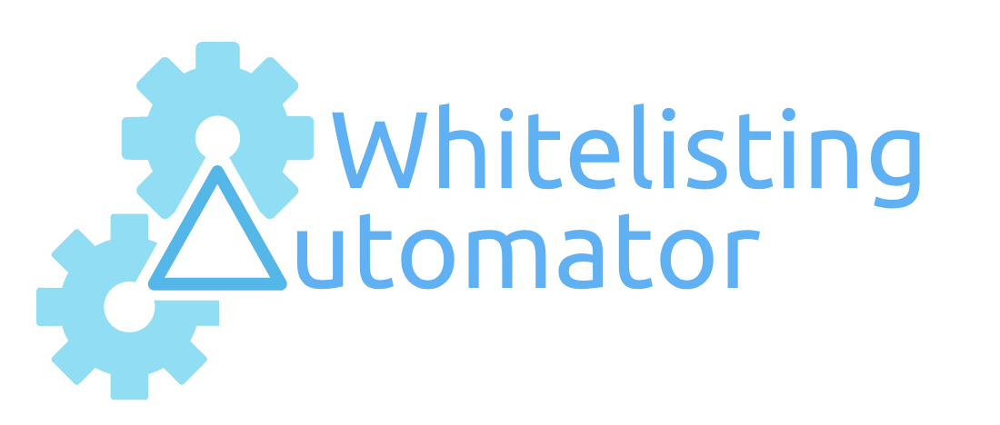

## requirements

### python 3

MAC OS
```bash
> brew install python3
```

Linux
```bash
> sudo apt-get install python3
```

### pip

MAC OS
installed with brew install python3

Linux
```bash
> sudo apt-get install python3-pip
```

### virtualenv
```bash
> sudo -H pip3 install virtualenv
``` 

### hub

MAC OS
```bash
> brew install hub
```

Linux

Download a binary release from [https://github.com/github/hub/releases](https://github.com/github/hub/releases)

or 

```bash
# you will need the Go development environment
> git clone https://github.com/github/hub.git && cd hub
# assuming that `~/bin` is in your PATH:
> script/build -o ~/bin/hub
```

## run
```bash
> ./run.sh
```